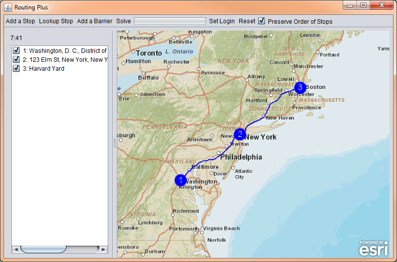

routing-plus-java
=================

Routing Plus expands on the [Point-to-Point Routing sample](https://developers.arcgis.com/java/sample-code/point-to-point-routing/) in the [ArcGIS Runtime SDK for Java](https://developers.arcgis.com/java/).

## Building from Source

### Requirements
* Java Development Kit (JDK) 7 or higher
* ArcGIS Runtime SDK for Java 10.2.3 or higher
* NetBeans 7.3 or higher is recommended. You can build with Ant, but all contributions must work in NetBeans (see [Contributing](#contributing)).
* To disable the map's watermark, you must create a new application in [ArcGIS for Developers](https://developers.arcgis.com/en/applications/).

### Steps
1. Clone this repo, or create a fork and clone your fork.
2. If you wish to disable the map's watermark, create a file called clientid.txt in [source/RoutingPlus/src/com/esri/wdc/routingplus](source/RoutingPlus/src/com/esri/wdc/routingplus) and paste into it the client ID from the application you created (see [Requirements](#requirements)).
3. Compile with NetBeans or Ant.
4. To deploy to a machine that doesn't have ArcGIS Runtime SDK, follow the [documentation on deploying your app](https://developers.arcgis.com/java/guide/deploy-your-app.htm).

## Issues

If you discover a bug in the application or you think of a useful feature that could be implemented, please create an issue. Feel free to address any issues if you are able (see [Contributing](#contributing)).

## Contributing

Contributions are welcome. Fork the repo, then create a pull request and it will be reviewed as time permits.

All contributions must work in NetBeans; therefore, it is highly recommended that all development be done with NetBeans, and it is required that all UI changes and additions be done with NetBeans.

## Licensing

Copyright 2014 Esri

Licensed under the Apache License, Version 2.0 (the "License");
you may not use this file except in compliance with the License.
You may obtain a copy of the License at

   http://www.apache.org/licenses/LICENSE-2.0

Unless required by applicable law or agreed to in writing, software
distributed under the License is distributed on an "AS IS" BASIS,
WITHOUT WARRANTIES OR CONDITIONS OF ANY KIND, either express or implied.
See the License for the specific language governing permissions and
limitations under the License.

A copy of the license is available in the repository's
[LICENSE](LICENSE) file.